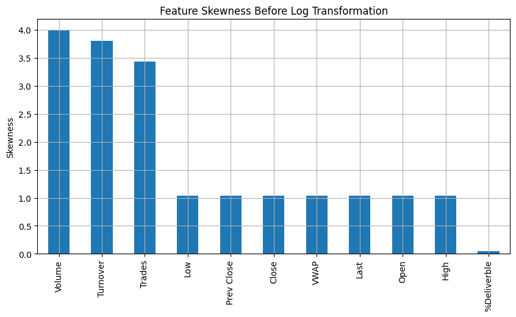
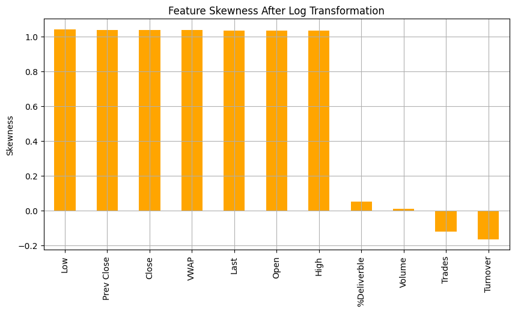
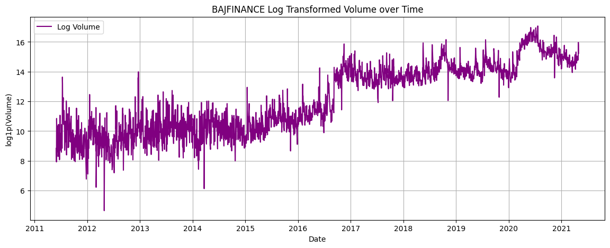
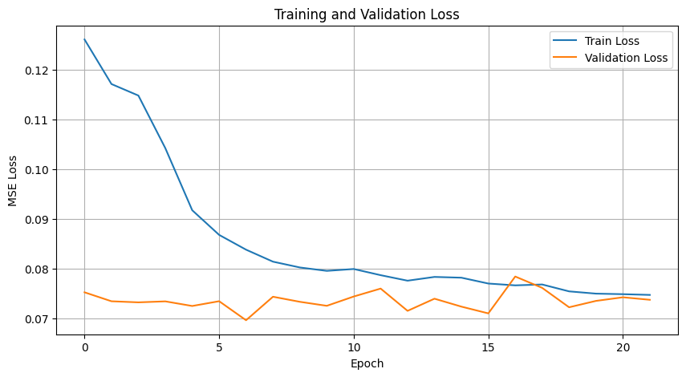
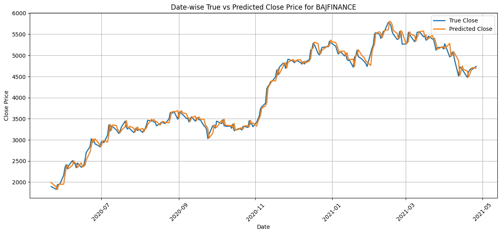

# 🚀 Multivariate Time-Series Stock Forecasting using LSTM

An advanced deep learning project aimed at predicting multi-output stock market indicators for **NIFTY-50 (BAJFINANCE)** using Long Short-Term Memory (LSTM) networks. 

---

## 🌟 Key Highlights
- **Multi-Output Forecasting:** Predicts 11 features (Open, High, Low, Volume, etc.) simultaneously for a 5-day horizon.
- **Advanced Preprocessing:** Implemented **Log-Normal Transformation** to stabilize variance and handle heavily skewed financial features.
- **GPU Accelerated:** Optimized for **NVIDIA Tesla T4 (CUDA)**, ensuring high-speed tensor computations.
- **Robust Evaluation:** Uses MSE and RMSE metrics to track model convergence over 150 epochs.

---

## 📊 Technical Process & Visualizations

### 1. Handling Skewed Data (Pre-processing)
Financial data often exhibits high skewness. I analyzed the distribution and applied **Log Transformation** to normalize the features, which significantly improved model convergence.
| Before Transformation | After Log Transformation |
|---|---|
|  |  |

### 2. Time-Series Cleaning & Volume Trends
Visualizing the raw vs cleaned volume data to ensure the LSTM captures the true market signals without noise.

### 3. Model Training (Loss Convergence)
The model was trained for 150 epochs using PyTorch. The smooth decline in both training and validation loss indicates a well-regularized model.

### 4. Final Predictions: True vs Predicted
The model effectively captures the price pivots and trends of the BAJFINANCE stock.

---

## 🧠 Model Architecture
- **Input:** 11 Market Features (Sliding window of 10 days)
- **Architecture:** 2 LSTM Layers (64/32 units) + Dropout (0.2)
- **Optimizer:** Adam with Learning Rate Scheduling
- **Output:** 55 Data Points (11 features × 5-day forecast)

---

## 🛠️ Tech Stack
- **Languages:** Python
- **Frameworks:** PyTorch, Scikit-learn
- **Data:** Pandas, NumPy
- **Visuals:** Matplotlib, Seaborn

---

## 🚀 Getting Started
1. Clone the repo: `git clone https://github.com/CodeAlch/Multi-Output-Time-series-Forecasting.git`
2. Install requirements: `pip install -r requirements.txt`
3. Run the notebook: `ms22-assignment-ayushmanmaurya-25mam006.ipynb`

---

## 👤 Author
**Ayushman Maurya**  
MSc AI & ML Student | Jamia Millia Islamia  
[LinkedIn](https://linkedin.com/in/4yushman) | [GitHub](https://github.com/CodeAlch)
